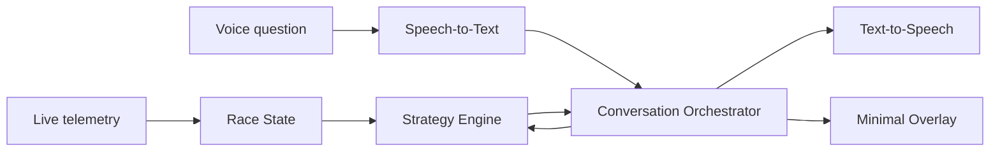

# Voice Race Engineer

Локальный голосовой AI race engineer для симрейсинга, который отвечает на вопросы пилота во время гонки на основе live telemetry и проверяемых стратегических расчетов.

Проект начинается с интеграции с iRacing SDK, но не является официальным продуктом iRacing и не связан с iRacing.com Motorsport Simulations.

## Идея

Во время гонки пилот может спросить:

- «Хватит ли топлива до финиша?»
- «Сколько нужно экономить, чтобы проехать еще один круг?»
- «А если экономить следующие пять кругов?»
- «Какой разрыв до машины впереди?»
- «Когда соперник, вероятно, поедет в боксы?»

Помощник распознает естественную речь, вызывает типизированный расчетный инструмент и озвучивает короткий ответ. Нейросеть помогает понять вопрос и поддерживать контекст разговора, но не придумывает гоночные данные и не выполняет расчеты самостоятельно.

## Чем проект отличается

Обычные overlays и Crew Chief уже хорошо закрывают визуализацию телеметрии, spotter-сообщения и фиксированные голосовые команды.

Фокус Voice Race Engineer:

- свободные формулировки вместо запоминания команд;
- контекст уточняющих вопросов;
- what-if расчеты гоночной стратегии;
- объяснимые ответы с исходными предположениями;
- строгая проверка всех озвучиваемых чисел;
- минимальный overlay, основной интерфейс — голосовой.

## Планируемая архитектура

- Windows-only desktop application;
- `.NET 10 LTS`, C# 14 и минимальный `WPF` overlay;
- официальный iRacing SDK/shared memory как источник live telemetry;
- детерминированный Strategy Engine для топлива и стратегии;
- локальные Speech-to-Text и Text-to-Speech;
- сменный LLM orchestrator с типизированным tool calling;
- локальный ML inference через ONNX Runtime;
- replay/mock источник данных для разработки и тестирования без запущенного симулятора.



## MVP

Первый вертикальный срез:

1. Читать live telemetry и session info.
2. Рассчитывать текущий расход и запас топлива.
3. Рассчитывать необходимую экономию для дополнительного круга.
4. Принимать голосовые вопросы через push-to-talk.
5. Озвучивать ответы на основе структурированного результата Strategy Engine.
6. Поддерживать контекстный уточняющий вопрос.
7. Записывать и воспроизводить сессию для тестирования.

## Текущий статус

Проект находится на стадии исследования и архитектурного проектирования.

- [ADR: архитектура локального AI race engineer](docs/adr/0001-local-ai-race-engineer-overlay.md)
- [Анализ существующих open-source overlays и Crew Chief](docs/research/0001-github-overlay-landscape.md)
- [Исследование C#/.NET библиотек iRacing SDK](docs/research/0002-dotnet-iracing-sdk-libraries.md)
- [Исследование локального STT/TTS стека](docs/research/0003-local-stt-tts-stack.md)
- [Архитектура Strategy Engine](docs/architecture/0001-strategy-engine.md)
- [Общий технический roadmap](docs/plan/0001-technical-roadmap.md)

Следующий milestone — `Replay Fuel Engineer`: детерминированные расчеты топлива и голосовые ответы над replay fixture без запущенного iRacing.

## Разработка

Требуется `.NET 10 SDK`. Версия SDK зафиксирована в `global.json`.

```bash
dotnet restore
dotnet test VoiceRaceEngineer.slnx
```

Общие настройки сборки находятся в `Directory.Build.props`: C# 14, nullable reference types, актуальные analyzers, warnings as errors и deterministic builds. Версии NuGet-пакетов управляются централизованно через `Directory.Packages.props`.

## Compliance

До письменного разъяснения iRacing проект предназначен только для личной разработки и тестирования в Test Drive, AI Racing и согласованных закрытых Hosted-сессиях.

Текущие ограничения проекта:

- только официальный SDK/shared memory;
- read-only относительно управления машиной и пит-настроек;
- отсутствие packet sniffing, process injection и изменения Sim Client;
- отсутствие автоматизации throttle, brake, steering, shifting и pit commands;
- отсутствие централизованного сбора или публикации telemetry.

Использование в Ranked/Official сессиях и распространение пока не подтверждены.

## Название и товарные знаки

iRacing является товарным знаком соответствующего правообладателя. Название используется только для описания совместимости и исследуемой интеграции.

## License

Лицензия пока не выбрана. До ее добавления все права на исходный код сохраняются за авторами проекта.
