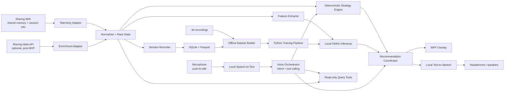

# ADR-0001: Локальный AI race engineer overlay для iRacing

- Статус: Proposed
- Дата: 2026-06-06
- Авторы: команда проекта
- Compliance status: Требуется письменное подтверждение iRacing до использования в Ranked/Official сессиях и распространения

## Контекст

Мы хотим создать оверлей для iRacing, который во время сессии:

- показывает полезные данные о собственной машине и соперниках;
- оценивает расход топлива и необходимый объем дозаправки;
- распознает пит-стопы и прогнозирует вероятные пит-окна соперников;
- позволяет пилоту во время гонки голосом задавать вопросы AI race engineer;
- выдает короткие, понятные и своевременные рекомендации голосом и в overlay.

iRacing предоставляет несколько разных источников данных:

1. **iRacing SDK / live telemetry** передает данные запущенного симулятора через shared memory на Windows. SDK поддерживает несколько клиентов, чтение live telemetry и некоторые команды симулятору, включая настройку пит-стопа.
2. **Session info** из SDK содержит метаданные текущей сессии, участников, машин и результатов.
3. **Дисковые `.ibt`-файлы** содержат записанную телеметрию и подходят для анализа и подготовки обучающих выборок после сессии.
4. **iRacing `/data API`** предоставляет профильные, исторические и результативные данные через HTTP, но не является источником низколатентной live telemetry.

Важное ограничение: подробные параметры управления и состояния доступны для собственной машины. Для соперников SDK предоставляет наблюдаемое состояние гонки, например позицию на трассе, круги, время и пит-статус, но не их детальный расход топлива или полную телеметрию управления. Значит, часть сведений о соперниках может быть только оценкой с явно указанной уверенностью.

На дату ADR регистрация новых OAuth client ID для iRacing приостановлена. Поэтому `/data API` нельзя считать обязательной зависимостью первого релиза.

Во время гонки критичны низкая задержка, стабильность и предсказуемое потребление ресурсов. Голосовой диалог является основной функцией продукта, но LLM не должен самостоятельно вычислять или придумывать гоночные данные. Источником чисел и решений остается детерминированный Strategy Engine, а нейросеть распознает запрос, вызывает разрешенные инструменты и формулирует короткий ответ.

## Проверка допустимости

Публичные документы iRacing не дают однозначного разрешения на AI race engineer во время соревновательной сессии.

Аргументы в пользу допустимости ограниченного прототипа:

- EULA разрешает использовать интерфейсы, прямо предоставленные iRacing, для личного некоммерческого использования.
- iRacing публично признает существование сторонних приложений, overlays и telemetry-приложений, включая Atlas и Motec.
- iRacing разрешает живого spotter/crew chief, который сообщает топливо, стратегию и данные соперников.
- Приложение использует только официальный SDK и доступные пользователю данные, не изменяет Sim Client и не перехватывает сетевой протокол.

Существенные риски:

- Раздел 5.1 EULA запрещает cheats, bots, AI, AI models и другое ПО, если оно предназначено для cheating или изменения iRacing experience.
- Разделы 5.7 и 19.1 оставляют iRacing право единолично определить, является ли приложение cheat или unauthorized program.
- EULA широко ограничивает сбор, копирование, создание производных работ и коммерческое использование Data.
- Документация OAuth прямо говорит, что iRacing не предоставляет сторонним разработчикам явного разрешения; использование SDK и API регулируется EULA.
- Отдельные профессиональные, призовые и eSport-серии могут иметь дополнительные правила.

Предварительный вывод, не являющийся юридической консультацией:

- **Допустимо для разработки:** локальный read-only прототип на официальном SDK в Test Drive, AI Racing и закрытых Hosted-сессиях с согласия участников.
- **Не подтверждено:** использование голосового AI race engineer в Ranked/Official сессиях.
- **Требует отдельного разрешения:** публикация, продажа, подписка, централизованный сбор телеметрии пользователей и обучение общей модели на данных iRacing.

До Ranked/Official использования и распространения необходимо получить письменный ответ iRacing Support или Legal с описанием функций. До получения ответа проект должен:

- использовать только официальный SDK/shared memory и документированные команды;
- оставаться read-only относительно управления машиной и пит-настроек;
- не автоматизировать throttle, brake, steering, shifting, in-car controls или pit commands;
- не использовать packet sniffing, process injection, чтение недокументированной памяти или изменение файлов Sim Client;
- не передавать телеметрию и данные участников в облако;
- не использовать iRacing trademarks в названии так, чтобы создавать впечатление официального продукта;
- тестироваться только в Test Drive, AI Racing и согласованных закрытых Hosted-сессиях.

### Вопрос для письменного согласования

> We are developing a personal, non-commercial, read-only voice race-engineer prototype using only the officially provided iRacing SDK/shared-memory telemetry. It answers driver-initiated voice questions about the driver's own fuel usage, estimated laps remaining, required fuel saving, gaps, and observable pit status. It does not modify the Sim Client, intercept network traffic, automate driving controls, or automatically change pit settings. Is this application permitted during Ranked/Official sessions? Would distributing it to other members or training prediction models from SDK-derived session data require separate written permission?

## Решение

Создать **Windows-only локальное desktop-приложение в виде модульного монолита**:

- платформа: `.NET 8`;
- UI overlay: `WPF` с прозрачным always-on-top окном и click-through режимом;
- интеграция с iRacing: локальный адаптер SDK/shared memory;
- хранение: `SQLite` для конфигурации и агрегатов, `Parquet` для обезличенных временных рядов сессий;
- ML inference во время гонки: локально через `ONNX Runtime`;
- голосовой интерфейс: push-to-talk, локальные STT и TTS, разговорный orchestrator с tool calling;
- LLM: сменный локальный или облачный провайдер с обязательным fallback на детерминированный intent router;
- обучение и эксперименты: отдельно, на Python, с экспортом утвержденной модели в ONNX;
- обмен между модулями: типизированные внутренние события, без отдельного брокера сообщений в MVP.

### Логическая архитектура

### Ответственность модулей

| Модуль | Ответственность |
|---|---|
| Telemetry Adapter | Подключение к SDK, чтение кадров и session info, обнаружение reconnect |
| Normalizer + Race State | Приведение данных к доменной модели, расчет кругов, stint, gap и событий |
| Deterministic Strategy Engine | Точные расчеты топлива, обязательных остановок и правил сессии |
| Feature Extractor | Подготовка признаков для моделей без доступа UI к сырым данным SDK |
| Local ONNX Inference | Прогноз пит-окна и других вероятностных событий |
| Recommendation Coordinator | Приоритизация, cooldown, confidence threshold, защита от спама |
| Speech-to-Text | Локальное распознавание речи после push-to-talk |
| Voice Orchestrator | Определение намерения, вызов разрешенных инструментов и формирование краткого ответа |
| Query Tools | Типизированные read-only запросы к Race State и Strategy Engine |
| Text-to-Speech | Локальная озвучка ответа с возможностью немедленного прерывания |
| Overlay | Отображение фактов, прогнозов и качества прогноза |
| Session Recorder | Сохранение данных для воспроизведения, отладки и обучения |

## Голосовой контур

Голосовой race engineer является частью MVP. Основной сценарий:

1. Пилот удерживает назначенную кнопку push-to-talk и задает вопрос.
2. Локальный STT преобразует речь в текст.
3. Voice Orchestrator определяет намерение и вызывает только разрешенный типизированный инструмент.
4. Strategy Engine или Race State возвращает структурированный ответ с числами, единицами измерения и уровнем уверенности.
5. Orchestrator формирует короткую реплику без изменения чисел.
6. Локальный TTS воспроизводит ответ; тот же ответ кратко отображается в overlay.

Примеры разрешенных инструментов:

| Инструмент | Пример вопроса |
|---|---|
| `get_fuel_status` | «Какой сейчас расход и на сколько кругов хватит топлива?» |
| `get_extra_lap_saving` | «Сколько нужно экономить, чтобы проехать еще один круг?» |
| `get_finish_fuel_plan` | «Сколько топлива останется на финише?» |
| `get_gap_to_car` | «Какой отрыв до машины впереди?» |
| `get_opponent_pit_prediction` | «Когда двенадцатый, вероятно, поедет в боксы?» |

Для `get_extra_lap_saving` Strategy Engine рассчитывает как минимум:

- доступное топливо до предполагаемого финиша;
- текущий устойчивый расход на круг;
- целевой расход для прохождения дополнительного круга;
- требуемую экономию в литрах на круг и процентах;
- достижимость цели и запас ошибки.

Пример ответа: `Нужно экономить 0,18 литра на круг, примерно 7%. Цель достижима, запас 0,3 литра.`

LLM получает только актуальный снимок нужных данных и схему доступных инструментов. Он не получает право напрямую изменять пит-настройки или управлять машиной. При недоступности LLM детерминированный intent router обязан поддерживать основные топливные и гоночные вопросы.

## Разделение фактов и прогнозов

Визуальный и голосовой интерфейсы обязаны разделять:

- **факты**: данные SDK и детерминированные вычисления;
- **оценки**: вычисленные значения, зависящие от предположений;
- **ML-прогнозы**: вероятностные результаты с confidence и горизонтом прогноза.

Пример:

- `Fuel remaining: 18.4 L` — факт SDK;
- `Estimated laps remaining: 8.2` — расчет;
- `Car #12 likely pits in 2–4 laps, confidence 71%` — прогноз.

Рекомендации с низкой уверенностью не показываются и не озвучиваются как факт. Прогнозы никогда автоматически не управляют машиной или пит-настройками без отдельного явного решения пользователя.

## Границы MVP

Первый вертикальный срез должен работать без `/data API`, но включает голосовой AI-интерфейс:

1. Подключиться к запущенному iRacing через SDK.
2. Показать состояние подключения, текущий круг, позицию, топливо и ближайших соперников.
3. Рассчитать расход топлива:
   - средний расход на валидный круг;
   - прогноз кругов до пустого бака;
   - объем топлива до финиша с настраиваемым запасом.
   - необходимую экономию для дополнительного круга.
4. По push-to-talk распознавать основные вопросы о топливе, оставшихся кругах и разрывах.
5. Отвечать голосом на основе структурированного результата Strategy Engine.
6. Распознавать вход и выход участников из пита.
7. Записывать нормализованный поток, события и обезличенные метрики голосового контура.
8. Воспроизводить записанную сессию без запуска iRacing для проверки ответов.

Первый ML-инкремент после накопления данных:

- прогноз `пит в следующие N кругов` для каждого соперника;
- базовая модель для сравнения: эвристика по длительности stint;
- кандидатные модели: gradient boosting или небольшая temporal model;
- метрики: precision/recall по пит-событиям, calibration error, latency inference;
- ML-функция принимается только если стабильно превосходит базовую эвристику.

Разговорная модель входит в MVP как orchestrator, но не как источник гоночных расчетов. MVP должен сохранять базовые голосовые команды при отсутствии сети или LLM-провайдера.

## Почему выбран этот вариант

### `.NET 8 + WPF`

- iRacing и live SDK фактически привязывают приложение к Windows.
- WPF достаточно зрел для прозрачного always-on-top overlay.
- Один runtime упрощает SDK adapter, доменную логику и UI.
- ONNX Runtime позволяет выполнять модели локально без Python в пользовательской установке.

### Модульный монолит

- Минимальная операционная сложность для pet project.
- Модули можно тестировать независимо через записанные сессии.
- При необходимости ingestion или training можно позднее вынести в отдельные процессы без изменения доменной модели.

### Детерминированные расчеты перед ML

- Расход топлива и объем дозаправки надежнее считать формулами.
- ML применяется только там, где есть неизвестность: поведение соперников и вероятные события.
- Такой подход дает понятную baseline-версию и позволяет измерить реальную пользу модели.

### Tool calling вместо свободного ответа LLM

- Пилоту нужен естественный разговор, но цена неверного числа во время гонки высока.
- Типизированные инструменты ограничивают доступ модели к данным и сохраняют вычисления тестируемыми.
- Разделение позволяет менять STT, LLM и TTS без переписывания Strategy Engine.

## Рассмотренные альтернативы

### Electron/TypeScript для всего приложения

Плюсы: быстрый UI, знакомая web-экосистема, много примеров оверлеев.

Минусы: потребуется native addon или отдельный процесс для SDK; выше расход ресурсов; сложнее обеспечить стабильность native bridge. Может быть пересмотрено, если web UI окажется важнее простоты интеграции.

### Python-приложение с ML внутри процесса

Плюсы: быстрые эксперименты с моделями.

Минусы: сложнее дистрибуция, прозрачный overlay и контроль задержек; обучающие зависимости попадут в runtime. Python остается инструментом offline training.

### Только облачный backend и LLM во время гонки

Отклонено из-за задержки, стоимости, зависимости от сети, приватности и непредсказуемости ответов. Облачная LLM допустима как сменный orchestrator, если основные голосовые запросы продолжают работать локально.

### Использовать `/data API` с первого дня

Отложено: API не нужен для live telemetry, OAuth onboarding новых приложений сейчас приостановлен, а продукт должен сохранять ценность без внешнего сервиса.

## Последствия

Положительные:

- приложение работает локально и не зависит от интернета во время гонки;
- можно начать с полезного MVP до появления ML-модели;
- пилот может получать информацию, не отрывая взгляд от трассы;
- записанные сессии обеспечивают воспроизводимые тесты и будущую выборку;
- рекомендации объяснимы и содержат оценку уверенности.

Отрицательные:

- поддерживается только Windows;
- потребуется аккуратная работа с SDK/shared memory и reconnect;
- распознавание речи в шуме, акцент и задержка ответа потребуют отдельной настройки;
- качественный прогноз поведения соперников потребует большого числа сессий;
- модель может плохо переноситься между классами машин, типами гонок и изменениями симулятора.

## Риски и меры

| Риск | Мера |
|---|---|
| Неверная рекомендация отвлекает пилота | Confidence threshold, cooldown, приоритеты, минималистичный UI |
| STT неверно распознал вопрос | Push-to-talk, подтверждение опасных действий, короткий текст распознанного запроса в overlay |
| LLM изменил или выдумал число | Только tool calling, структурированные результаты, проверка чисел перед TTS |
| Голосовой ответ мешает в критический момент | Приоритеты сообщений, прерываемый TTS, подавление некритичных ответов |
| Нет сети или недоступен LLM | Локальные STT/TTS и fallback intent router для основных запросов |
| Падение FPS или задержки | Sampling/aggregation вне UI thread, ограниченный inference rate, performance budget |
| Недостаточно данных для ML | Сначала эвристики; recorder и replay входят в MVP |
| Data leakage между train/test | Делить выборку по сессиям и датам, а не по отдельным кадрам |
| Изменение SDK или полей | Изолированный adapter, capability detection, contract tests на записях |
| Нарушение приватности | Local-first, opt-in для экспорта, минимизация и обезличивание данных |
| Ограничения условий iRacing | Перед публикацией повторно проверить Terms/EULA и не обещать постоянную доступность API |
| iRacing классифицирует AI race engineer как cheat или unauthorized program | Не использовать в Ranked/Official до письменного подтверждения; read-only дизайн; официальный SDK; отсутствие автоматического управления |

## Критерии проверки решения

До принятия ADR необходимо сделать технический spike:

1. Получить письменное разъяснение iRacing о допустимости функций и границ использования.
2. Прочитать live telemetry и session info в test drive.
3. Подтвердить доступность полей, необходимых для топлива, standings и pit detection.
4. Отобразить прозрачный overlay поверх iRacing без заметного влияния на FPS.
5. Голосом запросить расход, оставшиеся круги и экономию для дополнительного круга.
6. Проверить, что озвученные числа совпадают со структурированным ответом Strategy Engine.
7. Записать и воспроизвести одну сессию через внутреннюю доменную модель.
8. Измерить end-to-end latency и потребление CPU/RAM.

Целевые бюджеты MVP:

- обновление UI: 10–20 Hz;
- inference вероятностной модели: не чаще 1 Hz;
- p95 от telemetry frame до обновления overlay: менее 100 ms;
- p95 от окончания голосового вопроса до начала ответа: менее 2 секунд для основных локальных команд;
- отсутствие заметного влияния на стабильность симулятора.

После spike статус ADR меняется на `Accepted`, либо создается новый ADR с пересмотренным стеком.

## Открытые вопросы

- Какие типы гонок являются первыми: sprint, endurance или оба?
- Какие классы машин нужны для первой модели?
- Какие языки должен распознавать и озвучивать первый релиз: русский, английский или оба?
- Нужен ли только push-to-talk или также wake word?
- Допустим ли облачный LLM как опциональный режим, либо весь голосовой контур должен быть локальным?
- Должен ли overlay работать только для пилота или также в spectator/crew режиме?
- Допустима ли публикация обезличенного датасета пользователями?

## Источники

- [Исследование существующих open-source overlays и voice race engineer приложений](../research/0001-github-overlay-landscape.md)
- [iRacing OAuth: Introduction](https://oauth.iracing.com/oauth2/book/introduction.html)
- [iRacing OAuth: Data API workflow](https://oauth.iracing.com/oauth2/book/data_api_workflow.html)
- [iRacing OAuth: Client registration](https://oauth.iracing.com/oauth2/book/client_registration.html)
- [iRacing OAuth: Authorization flow](https://oauth.iracing.com/oauth2/book/auth_overview.html)
- [iRacing Terms of Use and EULA dated September 17, 2024](https://ir-core-sites.iracing.com/members/pdfs/20240917-iRacing%20Terms%20of%20Use%20and%20EULA%20dated%20Sept%2017%202024.pdf)
- [iRacing Official Sporting Code V.2026.03.10](https://ir-core-sites.iracing.com/members/pdfs/20260310-official_sporting_code_dated_Mar_10_2026.pdf)
- [iRacing support: understanding risks of third-party applications](https://support.iracing.com/support/solutions/articles/31000173894-enabling-or-disabling-legacy-read-only-authentication)
- [iRacing support: spotter and crew chief capabilities](https://support.iracing.com/support/solutions/articles/31000162971-spotting)
- [iRacing telemetry: ATLAS quick start](https://ir-core-sites.iracing.com/dev/atlas/atlas_quickstart.pdf)
- [Clone of the official iRacing C++ SDK, including SDK history and sample clients](https://github.com/vipoo/irsdk)
- [iRacing support: existing third-party telemetry remains separate from anonymized telemetry collection](https://support.iracing.com/support/solutions/articles/31000175681-2025-season-1-vehicle-telemetry-update-2025-02-18-01-)

Примечание: полная документация live SDK размещена на форуме iRacing и может требовать активную подписку. Перед реализацией spike необходимо сверить поля и актуальный SDK непосредственно с документацией и примерами из member area.
