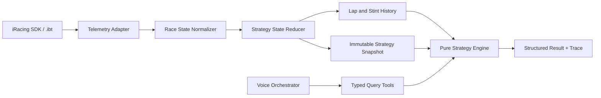

# Architecture: Deterministic Strategy Engine

- Статус: Proposed
- Runtime: `.NET 10 LTS`, C# 14
- Scope: топливная стратегия и детерминированные what-if расчеты

## Главный принцип

LLM может выбрать типизированный запрос и озвучить результат, но не вычисляет и не изменяет числовые значения.

Одинаковые telemetry snapshot и query всегда должны давать одинаковый результат. Каждый результат содержит единицы, assumptions, confidence, warnings и trace вычисления.

## Границы модулей



Strategy Engine не имеет доступа к SDK, системным часам, LLM, микрофону, базе данных или mutable global state.

## Доменная модель

```csharp
public readonly record struct Liters(decimal Value);
public readonly record struct LitersDelta(decimal Value);
public readonly record struct LitersPerLap(decimal Value);
public readonly record struct Laps(decimal Value);
public readonly record struct Seconds(decimal Value);
public readonly record struct Percentage(decimal Value);

public enum RaceLimitType
{
    LapLimited,
    TimeLimited,
    TimeAndLapLimited,
    Unlimited,
    Unknown
}

public sealed record CarProgress(
    int CompletedLaps,
    decimal LapFraction,
    Seconds? EstimatedLapTime)
{
    public decimal EquivalentLaps => CompletedLaps + LapFraction;
}

public sealed record StrategySnapshot(
    long SnapshotId,
    Seconds SessionTime,
    Liters FuelRemaining,
    CarProgress PlayerProgress,
    CarProgress? LeaderProgress,
    Seconds? SessionTimeRemaining,
    RaceRules RaceRules,
    TrackPhase TrackPhase,
    StintState CurrentStint,
    FuelModel FuelModel,
    DataQuality DataQuality);
```

## Классификация кругов

```csharp
public enum LapClassification
{
    Green,
    Caution,
    Formation,
    PitIn,
    PitOut,
    PitLane,
    Refuelled,
    Invalid,
    TowOrReset,
    Incomplete,
    Unknown
}
```

Pit, caution, formation, refuel, tow/reset и corrupted laps не должны молча попадать в оценку обычного расхода. Incident или off-track только помечает круг подозрительным; статистический estimator решает, исключать ли его.

## Оценка расхода

Для завершенного круга без дозаправки:

```text
consumption = fuel_at_lap_start - fuel_at_lap_end
```

Начальные настройки robust rolling estimator:

```text
window size:             8 laps
minimum usable samples:  3 laps
outlier threshold:       3 × normalized MAD
recent-lap weighting:    exponential decay
```

Алгоритм:

1. Рассчитать median `m`.
2. Рассчитать `MAD = median(abs(x_i - m))`.
3. Нормализовать `MAD` множителем `1.4826`.
4. Исключить выбросы сверх `max(3 × normalized_MAD, absolute_floor)`.
5. Рассчитать recency-weighted mean оставшихся значений.

Хранить отдельные модели для green laps, caution laps и нового водителя после driver change.

## Оставшаяся дистанция

### Lap-limited

```text
player_progress = completed_laps + lap_fraction
remaining_equivalent_laps = max(0, scheduled_laps - player_progress)
```

Голосовой ответ должен различать equivalent distance и количество пересечений финишной линии, чтобы избежать off-by-one ошибки.

### Time-limited

Окончание гонки зависит от момента пересечения финиша лидером после истечения времени. Начальная модель:

```text
leader_at_expiry =
    leader_progress_now
    + session_time_remaining / leader_lap_time

time_after_expiry =
    (ceil(leader_at_expiry) - leader_at_expiry) × leader_lap_time

time_until_checkered =
    session_time_remaining + time_after_expiry

player_at_checkered =
    player_progress_now + time_until_checkered / player_lap_time

remaining_equivalent_laps =
    ceil(player_at_checkered) - player_progress_now
```

Семантика должна быть подтверждена реальными записями, особенно для multiclass и отсутствующих данных лидера.

## Fuel to finish

Для:

- `F`: текущее топливо;
- `D`: remaining equivalent laps;
- `C`: planning consumption;
- `R`: reserve;

```text
predicted_burn = D × C
fuel_required = predicted_burn + R
fuel_margin = F - fuel_required
fuel_to_add = max(0, fuel_required - F)
```

`Liters` представляет физический неотрицательный объем топлива. `fuel_margin`
может быть отрицательным, поэтому возвращается как signed `LitersDelta`.

Reserve поддерживает фиксированные литры и эквивалент кругов.

## Экономия для дополнительного круга

Для:

- `F`: текущее топливо;
- `R`: защищенный reserve;
- `D`: нормальная оставшаяся дистанция;
- `E`: дополнительные круги;
- `C`: planning consumption;

```text
available_for_burn = F - R
target_distance = D + E
target_consumption = available_for_burn / target_distance
saving_per_lap = max(0, C - target_consumption)
saving_percentage = saving_per_lap / C × 100
```

Если экономить только следующие `K` кругов:

```text
normal_distance = target_distance - K
fuel_for_saving_laps =
    available_for_burn - normal_distance × C
target_consumption_during_saving =
    fuel_for_saving_laps / K
saving_per_saving_lap =
    C - target_consumption_during_saving
```

Ответ также содержит deterministic achievability: `AlreadyAchieved`, `Likely`, `Marginal`, `Unlikely`, `Impossible` или `Unknown`.

## Typed query tools

```csharp
public interface IStrategyQueryService
{
    StrategyResult<FuelStatus> GetFuelStatus(GetFuelStatusQuery query);
    StrategyResult<FuelToFinish> GetFuelToFinish(GetFuelToFinishQuery query);
    StrategyResult<ExtraLapSaving> GetExtraLapSaving(GetExtraLapSavingQuery query);
    StrategyResult<FuelScenario> EvaluateFuelScenario(EvaluateFuelScenarioQuery query);
}

public sealed record StrategyResult<T>(
    long SnapshotId,
    T Value,
    Confidence Confidence,
    IReadOnlyList<Assumption> Assumptions,
    IReadOnlyList<StrategyWarning> Warnings,
    CalculationTrace Trace);
```

Все запросы содержат `SnapshotId`. Устаревший snapshot возвращает warning, а не молча использует новые данные.

## Confidence

Confidence является детерминированной оценкой качества входных данных, а не гарантией будущего.

Факторы:

- количество usable green laps;
- разброс расхода;
- давность последнего usable sample;
- текущая track phase;
- доступность данных лидера;
- стабильность lap-time estimate;
- недавний pit/refuel/reconnect/driver change;
- изменение текущего темпа.

Engine имеет право ответить: «Недостаточно надежных данных».

## Доменные события

Reducer распознает:

```text
TelemetryConnected
TelemetryDisconnected
SessionStarted
SessionChanged
LapStarted
LapCompleted
PitEntered
PitExited
RefuelDetected
CautionStarted
CautionEnded
TowOrResetDetected
DriverChanged
CheckeredFlagObserved
```

## Тестирование

### Unit и boundary

- lap-limited и timed-race remaining distance;
- fuel-to-finish;
- reserve conversion;
- extra-lap и K-lap saving;
- ровно достаточное топливо;
- timer ровно на нуле;
- zero/one valid sample;
- refuel во время активного круга.

### Property-based invariants

```text
Больше текущего топлива не увеличивает требуемую экономию.
Больше дополнительных кругов не уменьшает требуемую экономию.
Больший reserve не улучшает fuel margin.
Большая дистанция при положительном расходе увеличивает fuel required.
Одинаковые snapshot и query дают идентичные числовые результаты.
```

### Replay и shadow validation

Golden recordings:

- lap-limited sprint;
- time-limited race;
- pit stop и refuel;
- caution;
- reconnect;
- fuel-saving stint;
- дополнительный финальный круг.

До доверия рекомендациям engine работает в shadow mode: прогнозирует, но не советует, затем сравнивает прогноз с фактическим финишным остатком.

## Требующие проверки предположения

1. Семантика и момент изменения `Lap`, `LapCompleted`, `SessionLapsRemain`.
2. Поведение `SessionTimeRemain` после нуля.
3. Надежные flags caution, white и checkered.
4. Пересечение линии на pit lane.
5. Overall leader progress в multiclass.
6. Tow/reset/reconnect/driver change.
7. Сессии, где заполнены и time, и lap limits.

До проверки adapter сохраняет важные raw SDK values рядом с normalized state.

## Источники

- [iRacing SDK shared-memory definitions](https://github.com/SIMRacingApps/SIMRacingAppsSIMPluginiRacing/blob/master/irsdk/irsdk_defines.h)
- [IRSDKSharper](https://github.com/mherbold/IRSDKSharper)
- [pyirsdk variable reference](https://github.com/kutu/pyirsdk)
- [Crew Chief](https://github.com/mrbelowski/CrewChiefV4)
