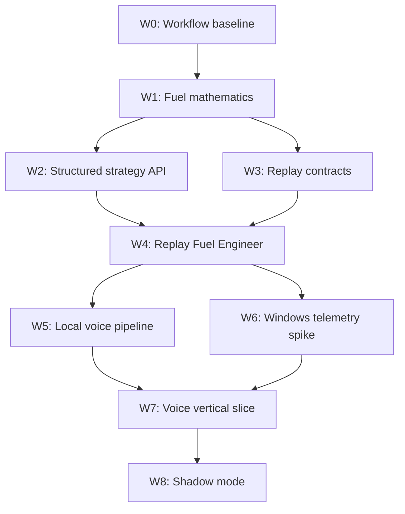

# Agent Execution Plan

- Статус: Active
- Цель: разбить разработку на небольшие проверяемые задачи, которые безопасно выполняются параллельными агентами
- Текущий baseline: commit `e1504a3`, `.NET 10`, четыре теста Strategy Core

## Принципы инкрементальной разработки

Каждый инкремент должен:

- давать проверяемое поведение, а не только каркас;
- занимать примерно от нескольких часов до двух рабочих дней;
- иметь один основной модуль и четкую write-зону;
- завершаться тестом, replay-сценарием, benchmark или работающим demo;
- не требовать одновременно незавершенных изменений другого агента;
- сохранять сборку и тесты зелеными.

Размер задачи считается слишком большим, если агенту нужно одновременно менять больше двух production-модулей или принимать несколько независимых архитектурных решений.

## Как читать backlog

- **Depends on**: задача не стартует до завершения зависимостей.
- **Write zone**: файлы, которыми владеет агент.
- **Acceptance**: проверяемое условие завершения.
- **Integration**: задачи, которые меняют solution, package management или связывают несколько модулей; выполняются последовательно.

## Карта инкрементов



## W0: Workflow Baseline

Цель: сделать работу агентов воспроизводимой.

| ID | Задача | Тип | Depends on | Write zone | Acceptance |
|---|---|---|---|---|---|
| `W0-01` | Agent instructions и execution backlog | Integration | — | `AGENTS.md`, `docs/plan/` | Правила и backlog доступны в репозитории |
| `W0-02` | Cross-platform CI для restore/build/test | Integration | `W0-01` | `.github/workflows/ci.yml` | CI проходит на push и PR |
| `W0-03` | Dependency/model license manifest | Independent | `W0-01` | `docs/compliance/dependencies.md` | У каждой выбранной зависимости есть source/license/status |

`W0-01` выполняется текущим изменением.

## W1: Fuel Mathematics

Цель: завершить чистую математику первого milestone без SDK, replay и голоса.

Задачи `W1-01` — `W1-04` можно выполнять параллельно: они используют отдельные production и test files.

| ID | Задача | Depends on | Write zone | Acceptance |
|---|---|---|---|---|
| `W1-01` | Усилить типизированные единицы и validation | `W0-01` | `src/VoiceRaceEngineer.Domain/Measurements.cs`, новый `tests/VoiceRaceEngineer.Domain.Tests/` | Negative/zero rules явно протестированы; арифметика единиц не допускает случайного смешивания |
| `W1-02` | Расчет lap-limited remaining distance | `W0-01` | новый `src/VoiceRaceEngineer.Strategy/RemainingDistance.cs`, новый test file | Покрыты partial lap, finish line и off-by-one cases |
| `W1-03` | Экономия только следующие `K` кругов | `W0-01` | новый `src/VoiceRaceEngineer.Strategy/FuelScenarioPlanning.cs`, новый test file | Возвращает target consumption, saving/lap и impossible result |
| `W1-04` | Boundary/property-style тесты текущего FuelPlanning | `W0-01` | новый `tests/VoiceRaceEngineer.Strategy.Tests/FuelPlanningBoundaryTests.cs` | Покрыты monotonic invariants, zero distance, exact fuel и invalid inputs |

Integration-задача после параллельной волны:

| ID | Задача | Depends on | Write zone | Acceptance |
|---|---|---|---|---|
| `W1-05` | Интеграция W1 и review математических контрактов | `W1-01..04` | только необходимые общие файлы | Все тесты проходят; API не содержит дублирующихся понятий |

## W2: Structured Strategy API

Цель: Strategy Engine возвращает не голые числа, а объяснимый аудируемый результат.

| ID | Задача | Depends on | Write zone | Acceptance |
|---|---|---|---|---|
| `W2-01` | Контракты Confidence, Assumption, Warning, CalculationTrace | `W1-05` | новые файлы в `VoiceRaceEngineer.Domain/StrategyResults/` | Immutable contracts, unit tests сериализации/equality |
| `W2-02` | Typed query contracts и snapshot freshness policy | `W1-05` | новые файлы в `VoiceRaceEngineer.Domain/StrategyQueries/` | Четыре query type; stale snapshot представлен явно |
| `W2-03` | Обернуть fuel calculations в structured results | `W2-01`, `W2-02` | новые файлы в `VoiceRaceEngineer.Strategy/Queries/`, новые tests | Каждый ответ содержит trace, assumptions и confidence |
| `W2-04` | Deterministic response formatter без LLM | `W2-03` | новый `VoiceRaceEngineer.Orchestration` project и tests | RU/EN текст строится только из structured result; числа совпадают |

`W2-01` и `W2-02` выполняются последовательно одним contract-owner либо в отдельных worktree с integration review, поскольку оба меняют Domain API.

## W3: Replay Contracts and State

Цель: тестировать стратегию на воспроизводимом потоке кадров без iRacing.

| ID | Задача | Depends on | Write zone | Acceptance |
|---|---|---|---|---|
| `W3-01` | NormalizedTelemetryFrame и domain events | `W1-05` | новый `VoiceRaceEngineer.Telemetry.Abstractions` project | Контракт не содержит типов стороннего SDK |
| `W3-02` | JSONL replay fixture schema и reader | `W3-01` | новый `VoiceRaceEngineer.Telemetry.Replay` project, tests, `fixtures/telemetry/` | Fixture читается streaming-образом и имеет версию schema |
| `W3-03` | Strategy State Reducer: lap boundaries и refuel | `W3-01` | новый `VoiceRaceEngineer.Strategy.State` namespace/files, tests | Из кадров детерминированно получаются completed lap measurements |
| `W3-04` | Lap classification: green/pit/caution/reset | `W3-03` | новые classification files/tests | Неподходящие круги не попадают в green consumption |
| `W3-05` | Robust consumption estimator median/MAD | `W3-03` | новый estimator file/tests | Выбросы отбрасываются; минимум samples соблюдается |

После `W3-01` задачи `W3-02` и `W3-03` могут идти параллельно. `W3-04` и `W3-05` стартуют после базового reducer, но могут идти параллельно друг другу.

## W4: Replay Fuel Engineer

Цель: первый end-to-end milestone без iRacing и без speech models.

| ID | Задача | Depends on | Write zone | Acceptance |
|---|---|---|---|---|
| `W4-01` | Strategy Snapshot assembler | `W2-03`, `W3-04`, `W3-05` | новые assembler files/tests | В любой replay-точке создается immutable snapshot |
| `W4-02` | Console replay demo | `W2-04`, `W3-02`, `W4-01` | новый `VoiceRaceEngineer.ReplayCli` project | CLI отвечает на четыре fuel queries по fixture |
| `W4-03` | Golden replay acceptance tests | `W4-02` | `tests/VoiceRaceEngineer.Replay.Tests/`, fixtures | Exact structured answers проверяются в выбранных snapshot IDs |

Milestone готов, когда команда:

```bash
dotnet run --project src/VoiceRaceEngineer.ReplayCli -- fixtures/telemetry/lap-limited.jsonl
```

возвращает устойчивый расход, remaining distance, fuel margin и экономию для дополнительного круга.

## W5: Local Voice Pipeline

Цель: локально распознать вопрос и озвучить проверенный текст, пока без live telemetry.

| ID | Задача | Depends on | Write zone | Acceptance |
|---|---|---|---|---|
| `W5-01` | Voice abstractions и audio contracts | `W0-03` | новый `VoiceRaceEngineer.Voice.Abstractions` project | STT/TTS/VAD interfaces не зависят от backend |
| `W5-02` | Offline file-based Whisper.net spike | `W5-01` | spike project, benchmark results | RU/EN fixtures распознаются; latency измерена |
| `W5-03` | sherpa-onnx/Piper и Windows TTS spike | `W5-01` | spike project, benchmark results | TTFA и понятность чисел измерены; лицензия voice зафиксирована |
| `W5-04` | Push-to-talk capture + Silero VAD | `W5-01` | Windows-only voice adapter, tests где возможно | Фраза захватывается, тишина удаляется, собственный TTS блокирует STT |
| `W5-05` | Выбор backend по benchmark | `W5-02..04` | ADR/research update | Решение содержит измерения, а не предположение |

`W5-02`, `W5-03` и `W5-04` можно выполнять параллельно после контрактов.

## W6: Windows Telemetry Spike

Цель: подтвердить выбранный SDK adapter на реальном iRacing.

| ID | Задача | Depends on | Write zone | Acceptance |
|---|---|---|---|---|
| `W6-01` | `IIracingTelemetrySource` adapter contract | `W3-01` | новый `VoiceRaceEngineer.Telemetry.IRacing` project contract/tests | Типы SDK не выходят из adapter |
| `W6-02` | Live variable reader | `W6-01` | adapter implementation | Минимальный набор переменных стабильно читается |
| `W6-03` | Session Info + reconnect | `W6-02` | adapter implementation/tests/logs | Ошибки YAML не валят процесс; reconnect работает |
| `W6-04` | `.ibt` parity validation | `W6-02`, `W3-02` | Windows spike/tests/report | Live и `.ibt` нормализуются одинаково |
| `W6-05` | SDK semantics report | `W6-03`, `W6-04` | `docs/research/` | Проверены lap/time/pit/flag assumptions |

Эти задачи требуют Windows и установленного iRacing; не раздавать агентам без доступа к этой среде.

## W7: Voice Vertical Slice

Цель: голосовой диалог над live или replay Strategy Snapshot.

| ID | Задача | Depends on | Write zone | Acceptance |
|---|---|---|---|---|
| `W7-01` | Deterministic intent router для четырех fuel tools | `W2-02`, `W4-02` | Orchestration files/tests | Основные RU/EN формулировки работают без LLM |
| `W7-02` | Conversation context для follow-up | `W7-01` | отдельные context files/tests | «А еще один круг?» использует предыдущую тему |
| `W7-03` | LLM tool-calling adapter | `W7-01` | отдельный adapter project/tests | LLM может выбрать tool, но не изменить result numbers |
| `W7-04` | Voice pipeline integration | `W5-05`, `W7-02` | integration host | Вопрос превращается в structured answer и TTS |
| `W7-05` | Minimal debug overlay | `W7-04`, `W6-02` | Windows WPF app | Показывает transcript, answer, snapshot ID, confidence |

`W7-02` и `W7-03` могут идти параллельно после `W7-01`.

## W8: Shadow Mode

Цель: измерить надежность до активных рекомендаций.

| ID | Задача | Depends on | Write zone | Acceptance |
|---|---|---|---|---|
| `W8-01` | Prediction/error recorder | `W7-04`, `W6-03` | telemetry/validation module | Ошибка fuel prediction измеряется по кругам |
| `W8-02` | Performance instrumentation | `W7-04`, `W6-03` | diagnostics module | Измеряются frame time, STT/TTS latency, dropped frames |
| `W8-03` | Shadow-mode validation report | `W8-01`, `W8-02` | `docs/validation/` | Есть go/no-go решение для активных советов |

## Ближайшая параллельная волна

Сейчас можно безопасно запустить четырех агентов:

| Agent | Task | Ownership |
|---|---|---|
| Agent A | `W1-01` Typed measurements | `VoiceRaceEngineer.Domain/Measurements.cs`, новый Domain tests project |
| Agent B | `W1-02` Lap-limited remaining distance | новый `RemainingDistance.cs` и отдельный test file |
| Agent C | `W1-03` K-lap fuel scenario | новый `FuelScenarioPlanning.cs` и отдельный test file |
| Agent D | `W1-04` FuelPlanning boundary tests | только новый test file |

После их завершения один integration-agent выполняет `W1-05`.

## Шаблон задания агенту

```text
Task ID: W1-02
Goal: Implement deterministic lap-limited remaining-distance calculation.

Read first:
- AGENTS.md
- docs/architecture/0001-strategy-engine.md
- docs/plan/0002-agent-execution-plan.md

Ownership:
- Create src/VoiceRaceEngineer.Strategy/RemainingDistance.cs
- Create tests/VoiceRaceEngineer.Strategy.Tests/RemainingDistanceTests.cs
- Do not modify other production files unless compilation requires it.

Acceptance:
- Calculates equivalent remaining laps from completed laps and lap fraction.
- Covers partial lap, exact finish line, already finished, and invalid input.
- Avoids off-by-one ambiguity by returning both equivalent distance and remaining finish-line crossings.
- `dotnet test VoiceRaceEngineer.slnx --disable-build-servers -m:1` passes.
- `git diff --check` passes.

Completion report:
- Changed files
- Tests run
- Assumptions
- Follow-up risks
```

## Правила запуска агентов

1. Перед волной integration-owner проверяет, что зависимости завершены.
2. Каждому агенту передается Task ID, цель, ownership и acceptance.
3. Для параллельных code tasks использовать отдельные worktree или disjoint write-зоны.
4. Не запускать двух агентов на одну задачу.
5. После волны integration-agent:
   - просматривает изменения;
   - устраняет дублирование API;
   - запускает полный test suite;
   - обновляет backlog;
   - создает один интеграционный commit.
6. Задача считается завершенной только после проверки acceptance, а не после сообщения агента.

## Definition of Done

Для любой code task:

- acceptance выполнен;
- новый behavior покрыт тестами;
- полный test suite зеленый;
- `git diff --check` зеленый;
- analyzers не отключены;
- документация обновлена, если изменился контракт;
- нет изменений вне ownership без объяснения;
- completion report содержит ограничения.

Для research/spike task:

- есть воспроизводимый benchmark или observation;
- источники и версии зафиксированы;
- assumptions отделены от подтвержденных фактов;
- сформулировано решение и условия его пересмотра.
