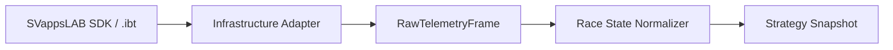

# Исследование C#/.NET библиотек iRacing SDK

- Дата проверки: 2026-06-06
- Статус решения: кандидат выбран, требуется технический spike на Windows с iRacing

## Решение

Для первого прототипа использовать [`SVappsLAB/iRacingTelemetrySDK`](https://github.com/SVappsLAB/iRacingTelemetrySDK) как реализацию чтения live telemetry, Session Info и `.ibt`.

Библиотека должна быть скрыта за собственным интерфейсом `IIracingTelemetrySource`. Ее типы не должны выходить из infrastructure-слоя. Это позволит заменить библиотеку после spike без изменений Strategy Engine и голосового контура.

Не писать полноценный shared-memory reader с нуля на первом этапе. Не использовать GPL-зависимость `IRSDKSharper`, пока лицензия нашего проекта не выбрана осознанно.

Broadcast и pit-команды не входят в MVP. Если они понадобятся позже, для них создается отдельный минимальный adapter, выключенный по умолчанию и недоступный LLM напрямую.

## Сравнение

| Библиотека | Лицензия | Последняя проверенная активность | Live telemetry | Session Info | Broadcast / pit | `.ibt` | .NET 8 |
|---|---|---:|---:|---:|---:|---:|---:|
| [SVappsLAB/iRacingTelemetrySDK](https://github.com/SVappsLAB/iRacingTelemetrySDK) | Apache-2.0 | 2026-04-25 | Да | Да | Нет | Да | Да |
| [mherbold/IRSDKSharper](https://github.com/mherbold/IRSDKSharper) | GPL-3.0 | 2026-04-07 | Да | Да | Да | Нет | Да |
| [SlevinthHeaven/irsdkSharp](https://github.com/SlevinthHeaven/irsdkSharp) | MIT | 2022-09-13 | Да | Да, отдельный пакет | Да | Не подтверждено | Через `net6.0` |
| [vipoo/iRacingSDK.Net](https://github.com/vipoo/iRacingSDK.Net) | Неясно | Архивирован, 2023-02-23 | Да | Да | Частично | Нет | Рискованно |

Важно: `Replay support` может означать чтение телеметрии из запущенного iRacing Replay, а не чтение `.ibt` файла.

## Почему SVappsLAB

Заявленные возможности:

- live shared memory на Windows;
- типизированные telemetry variables;
- типизированный и raw Session Info YAML;
- чтение и воспроизведение `.ibt`;
- общий API для live и `.ibt`;
- async streams и политика `drop-oldest`;
- метрики обработанных и потерянных кадров;
- source generator для telemetry DTO;
- `.NET 8+`;
- Apache-2.0.

Риски, которые должен проверить spike:

- небольшая пользовательская база;
- отсутствие broadcast-команд;
- совместимость source generator с нашей доменной моделью;
- доступность редких или новых SDK-переменных;
- устойчивость Session Info parser после изменений iRacing;
- возможные конфликты версий `Microsoft.Extensions.*`;
- reconnect и поведение при медленном consumer.

## Архитектурная граница

```csharp
public interface IIracingTelemetrySource
{
    IAsyncEnumerable<RawTelemetryFrame> ReadTelemetryAsync(
        CancellationToken cancellationToken);

    IAsyncEnumerable<RawSessionInfo> ReadSessionInfoAsync(
        CancellationToken cancellationToken);
}
```

`RawTelemetryFrame` сохраняет важные исходные SDK-значения, но следующий слой преобразует его в собственный immutable `NormalizedTelemetryFrame`.



## Переменные для первого spike

Минимальный набор, точную доступность и семантику которого нужно подтвердить:

- `FuelLevel`;
- `FuelUsePerHour`;
- `Lap`;
- `LapCompleted`;
- `LapDistPct`;
- `SessionTime`;
- `SessionTimeRemain`;
- `SessionLapsRemain`;
- `SessionFlags`;
- `OnPitRoad`;
- `PlayerCarIdx`;
- `CarIdxLap`;
- `CarIdxLapCompleted`;
- `CarIdxLapDistPct`;
- `CarIdxOnPitRoad`.

## План spike: 3–5 дней

### 1. Live connection

- Запустить `.NET 8 Windows` console-приложение.
- Читать минимальный набор переменных на частоте SDK.
- Измерять dropped frames, allocations и исключения.

Критерий: стабильное чтение до 60 Hz без необработанных исключений.

### 2. Session Info

Проверить Practice, Qualifying, Race, AI Race и multiclass.

Критерий: доступны список участников, классы, трасса и данные сессии; ошибка YAML не завершает процесс.

### 3. Lifecycle

Проверить запуск приложения до iRacing, reconnect, переход между сессиями, работу два часа и медленного consumer.

Критерий: автоматическое восстановление, измеряемые dropped frames, отсутствие блокировки reader со стороны Strategy Engine.

### 4. `.ibt` playback

Критерий: live и `.ibt` проходят через один normalizer и создают одинаковые внутренние snapshots.

### 5. Fuel prototype

Критерий: расчет расхода, остатка и экономии полностью воспроизводится из записи без LLM.

## Условия пересмотра

Отказаться от выбранной библиотеки, если обнаружится:

- нестабильное live-чтение;
- отсутствие критичных переменных;
- существенное расхождение live и `.ibt`;
- критические ошибки Session Info parser;
- невозможность безопасного reconnect;
- source generator мешает изоляции infrastructure-слоя.

Следующий вариант: собственный permissive adapter по документированному формату SDK с минимальной поверхностью.

## Источники

- [SVappsLAB README](https://github.com/SVappsLAB/iRacingTelemetrySDK/blob/main/README.md)
- [SVappsLAB project configuration](https://github.com/SVappsLAB/iRacingTelemetrySDK/blob/main/Sdk/SVappsLAB.iRacingTelemetrySDK/SVappsLAB.iRacingTelemetrySDK.csproj)
- [SVappsLAB NuGet](https://www.nuget.org/packages/SVappsLAB.iRacingTelemetrySDK/)
- [IRSDKSharper README](https://github.com/mherbold/IRSDKSharper/blob/main/README.md)
- [IRSDKSharper project configuration](https://github.com/mherbold/IRSDKSharper/blob/main/IRSDKSharper.csproj)
- [irsdkSharp README](https://github.com/SlevinthHeaven/irsdkSharp/blob/main/README.md)
- [Community iRacing SDK documentation](https://sajax.github.io/irsdkdocs/)
